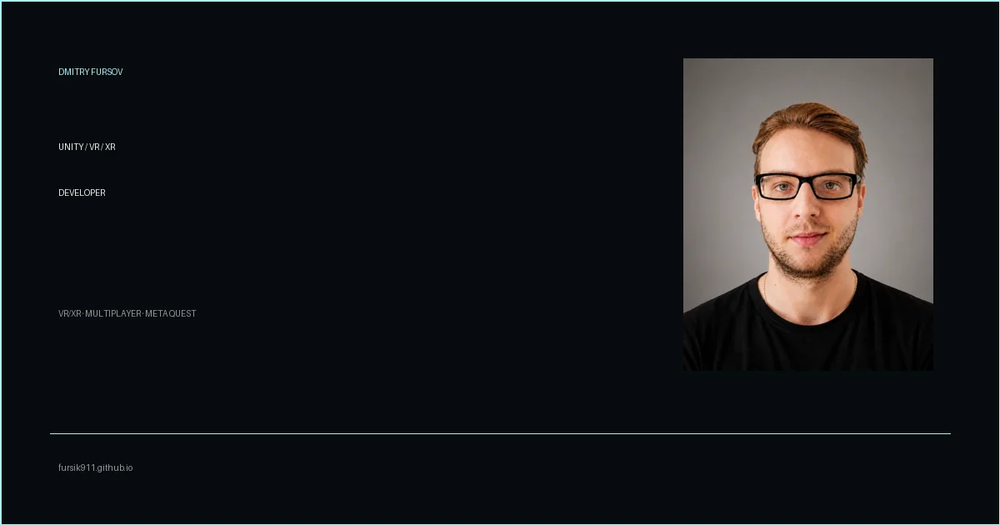

# Dmitry Fursov — Software Developer

<p align="center">
  <a href="https://fursik911.github.io/">
    
  </a>
</p>

<p align="center">
  <a href="https://fursik911.github.io/">Live portfolio</a>
  ·
  <a href="https://github.com/FursiK911">GitHub</a>
  ·
  <a href="https://www.linkedin.com/in/dmitry-fursov-251097213/">LinkedIn</a>
  ·
  <a href="https://t.me/FursiK911">Telegram</a>
  ·
  <a href="mailto:19fursik99@gmail.com">Email</a>
</p>

This repository contains the source code for my personal software development portfolio. The website presents selected experience across web, mobile, Unity, Unigine, XR/AR, and real-time products.

The portfolio is available at **[fursik911.github.io](https://fursik911.github.io/)**.

## Highlights

- Bilingual interface with Russian and English content, browser language detection, and a persistent language switch.
- Responsive portfolio experience with animated sections, project case pages, media galleries, and accessible interactions.
- Reduced-motion support across the site's animation system.
- Localized CV downloads for Frontend Developer and Unity Developer profiles.

## Tech stack

- React 19 and TypeScript
- Vite
- Mantine
- Motion and GSAP
- i18next and react-i18next
- Three.js and postprocessing
- Vitest, Testing Library, ESLint, and Prettier

## Local development

Requirements: Node.js 24 and npm 11.

```bash
npm ci
npm run dev
```

Open the local Vite server shown in the terminal to view the portfolio during development.

## Quality checks

Run the full project validation before publishing changes:

```bash
npm run validate
```

The validation pipeline checks formatting, linting, TypeScript, test coverage, the production build, and production assets. To create a production build separately:

```bash
npm run build
```

## CV

The portfolio provides localized PDF resumes from `public/cv/`:

- [Frontend Developer — English](./public/cv/Dmitry-Fursov-Frontend-Developer-EN.pdf)
- [Frontend Developer — Russian](./public/cv/Dmitry-Fursov-Frontend-Developer-RU.pdf)
- [Unity Developer — English](./public/cv/Dmitry-Fursov-Unity-Developer-EN.pdf)
- [Unity Developer — Russian](./public/cv/Dmitry-Fursov-Unity-Developer-RU.pdf)

## Deployment

The site is deployed to GitHub Pages from the `main` branch. The workflow in [`.github/workflows/deploy.yml`](./.github/workflows/deploy.yml) runs on every push to `main` and can also be started manually with `workflow_dispatch`.

The Vite base path is `/`, matching the repository's GitHub Pages user-site URL.
